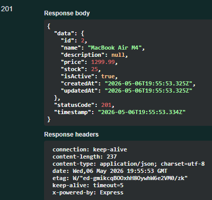

## Student
- Name: Терещенко Іван Олегович
- Group: 232\2
 
## Практичне заняття №6 — Interceptors + Exception Filters + Swagger
 
### Структура репозиторію
```
.
├── src/
│   ├── auth/ ...
│   ├── users/ ...
│   ├── categories/ ...
│   ├── products/ ...
│   ├── common/
│   │   ├── enums/
│   │   │   └── role.enum.ts
│   │   ├── guards/
│   │   │   ├── jwt-auth.guard.ts
│   │   │   └── roles.guard.ts
│   │   ├── decorators/
│   │   │   ├── current-user.decorator.ts
│   │   │   └── roles.decorator.ts
│   │   ├── interceptors/
│   │   │   ├── logging.interceptor.ts
│   │   │   └── transform.interceptor.ts
│   │   ├── filters/
│   │   │   └── http-exception.filter.ts
│   │   └── pipes/
│   │   	└── trim.pipe.ts
│   ├── migrations/
│   ├── main.ts
│   └── app.module.ts
├── swagger-screenshot.png
├── Dockerfile
├── docker-compose.yml
└── README.md
```
 
### Запуск проекту
```bash
cp .env.example .env
docker compose up --build
```
 
### Swagger UI
http://localhost:3000/api/docs
 

 
### Формат успішної відповіді
```json
{
  "data": {
    "id": 1,
    "name": "MacBook Air M4",
    "price": 1299.99,
    "stock": 25
  },
  "statusCode": 201,
  "timestamp": "2026-06-01T08:21:57.000Z"
}
```
 
### Формат помилки
```json
{
  "error": {
    "code": 400,
    "message": "Validation failed",
    "details": ["name must be longer than or equal to 2 characters", "price must not be less than 0.01"],
    "traceId": "9b7a9d6f-c82c-48fd-94b0-41ed0778b94c"
  },
  "timestamp": "2026-06-01T08:22:18.000Z"
}
```
 
### Приклад логів (LoggingInterceptor)
```text
app-1 | [Nest] 29 - 06/01/2026, 8:21:57 AM LOG [HTTP] POST /api/products — 201 — 19ms
app-1 | [Nest] 29 - 06/01/2026, 8:22:18 AM ERROR [Exception] [9b7a9d6f-c82c-48fd-94b0-41ed0778b94c] POST /api/products — 400 — Validation failed```
 
### Тест помилки з traceId
```text
{
  "error": {
    "code": 404,
    "message": "Product with ID 999 not found",
    "details": [],
    "traceId": "c5f1a9d2-b8e4-4291-a123-456789abcdef"
  },
  "timestamp": "2026-06-01T11:20:00.000Z"
}
```
